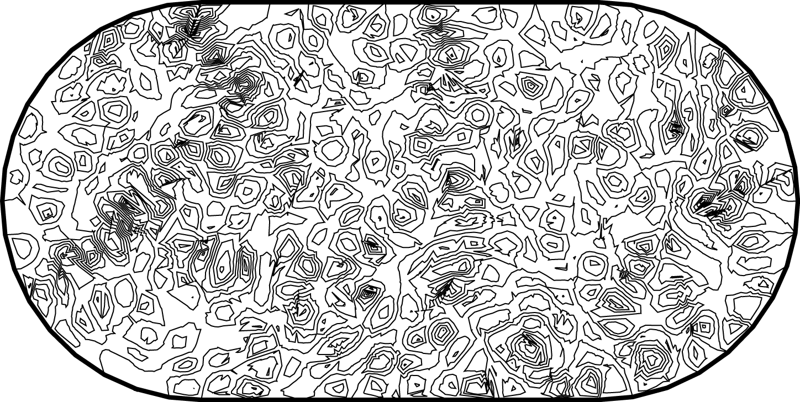
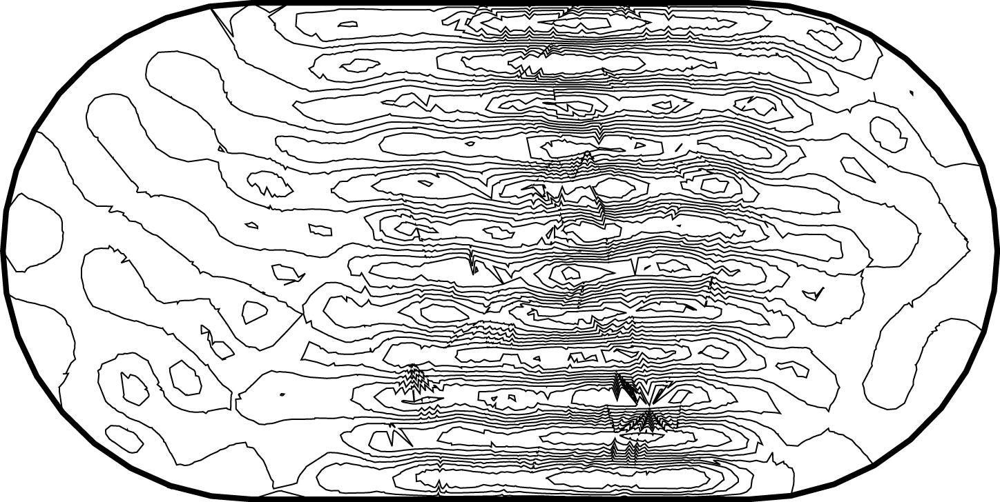
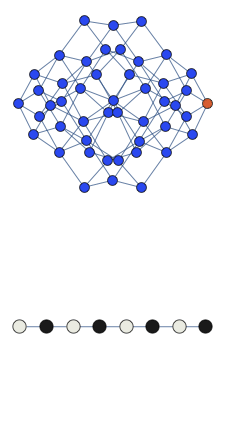

We construct theory of unusual revivals observed in Rydberg atom arrays

<!--more-->

Quantum scars present an example of weak ergodicity breaking in a context of quantum chaos. In our recent work in [Nature Physics](https://www.nature.com/articles/s41567-018-0137-5), we also generalized this concept to the many-body case.

## Quantum scars in a billiard

Imagine a ball bouncing around in an oval stadium. It will bounce around chaotically, back and forth through the available space. As its motion is random, it will sooner or later visit every place in the stadium as is illustrated in the example below:

Amidst all the chaos, however, there might be a potential for order: if the ball happens to hit the wall at a special spot and at the “correct” angle of incidence, it might end up in a periodic orbit, visiting the same places in the stadium over and over and not visiting the others. Such a periodic orbit is extremely unstable as the slightest perturbation will divert the ball off its track and back into chaotic pondering around the stadium:

The same idea is applicable to quantum systems, except that instead of a ball bouncing around, we are looking at a wave, and instead of a trajectory, we are observing a probability function. Classical periodic orbits can cause a quantum wave to be concentrated in its vicinity, causing a “scar”-like feature in a probability that would otherwise be uniform. Such imprints of classical orbits on the probability function have been named “quantum scars”. Below we compare the “scarred“ eigenstate in the stadium with the more typical state:

 

## Quantum many-body scars

We observed quantum-scarred eigenstates in the theoretical model that describes a chain of Rydberg atoms. All atoms in the chain can be in two possible states: excited and ground state. Moreover there exist a constraint that prohibits two excited atoms to be adjacent to each other. We found a coherent oscillations in such a system which underlie the quantum-scarred eigenstates. Below we show the animated cartoon of this trajectory for L=8 atoms.

Here the graph shows the space of all possible configurations, and the bottom shows the average density of excitation on each site. Animation shows oscillations between two patterns.
