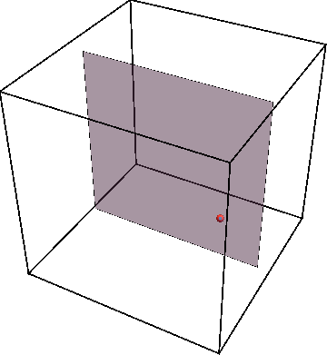
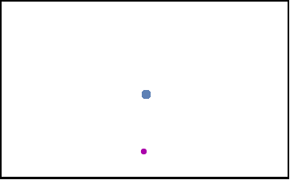
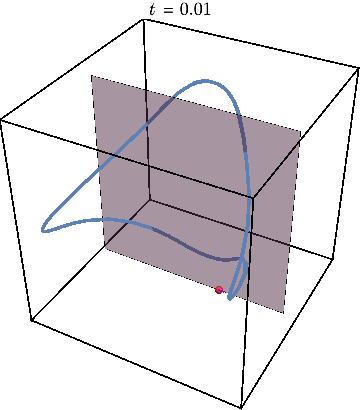
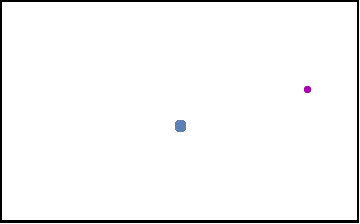

We show evidence of mixed phase space in TDVP projection of unitary dynamics of interacting quantum systems.

<!--more-->

Intuition suggests that generic, strongly interacting quantum systems establish thermal equilibrium even in isolation. In the process of thermalization, quantum information encoded in the system becomes irrecoverable. Hence, it is highly desirable to understand how thermal equilibrium is established and if it can be delayed. In our recent paper, [Phys. Rev. X, 10, 011055 (2020)](https://journals.aps.org/prx/abstract/10.1103/PhysRevX.10.011055), we provide a framework that allows one to find the slowly thermalizing states in strongly interacting quantum systems.

Using mathematical techniques to map the quantum dynamics of a strongly interacting system into a classical nonlinear dynamical system, we show that the resulting dynamical system generally has a mixed phase space where regions with regular motion coexist with chaotic islands. This can be illustrated by using [Poincare maps](https://en.wikipedia.org/wiki/Poincar%C3%A9_map). The animation below shows an example of the periodic trajectory in the dynamical system obtained from a quantum model.

If we now initialize system not on the periodic trajectory but close-by in parameter space, the new trajectory will remain close to the periodic one as the animation below shows.

Now we can get rid of third dimension by tracking the times when trajectory crosses the gray plane. The periodic trajectory reduces to a simple dot on such a Poincare map, while the nearby trajectory generates a circle  —  a cross-section of KAM torus:

Finally, we may illustrate what happens when system is initialized far away from this periodic trajectory, resulting in chaos:

The Poincare section now looks very different from before:

Plotting the Poincare map for many different initial conditions shown by a different color, we obtain the figures used in the paper to illustrate the mixed character of phase space, where star shows location of periodic trajectory:

Since the trajectory of interest are stable, i.e. cannot be described by Lyapunov exponent, we characterize the error encountered in approximating quantum dynamics by a classical dynamical system. When the error is small, initializing the quantum system in the regular region of phase space can give rise to spectacular many-body revivals, in which the system periodically returns to its original state. This generalizes the mechanism of quantum many-body scars—revivals that happen when there is an unstable periodic trajectory. However, even when the error is large, we show that our framework can find states with parametrically slower thermalization.

Our work provides a practical tool to search for slowly thermalizing states of strongly interacting quantum systems. Moreover, our work puts the intriguing connection between classical and quantum chaos in many-body systems on a firm basis.