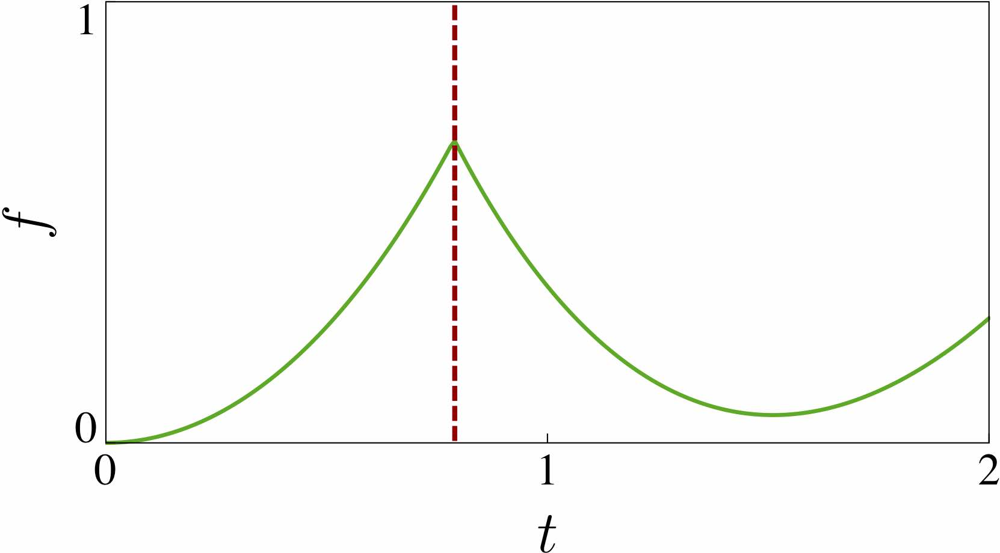
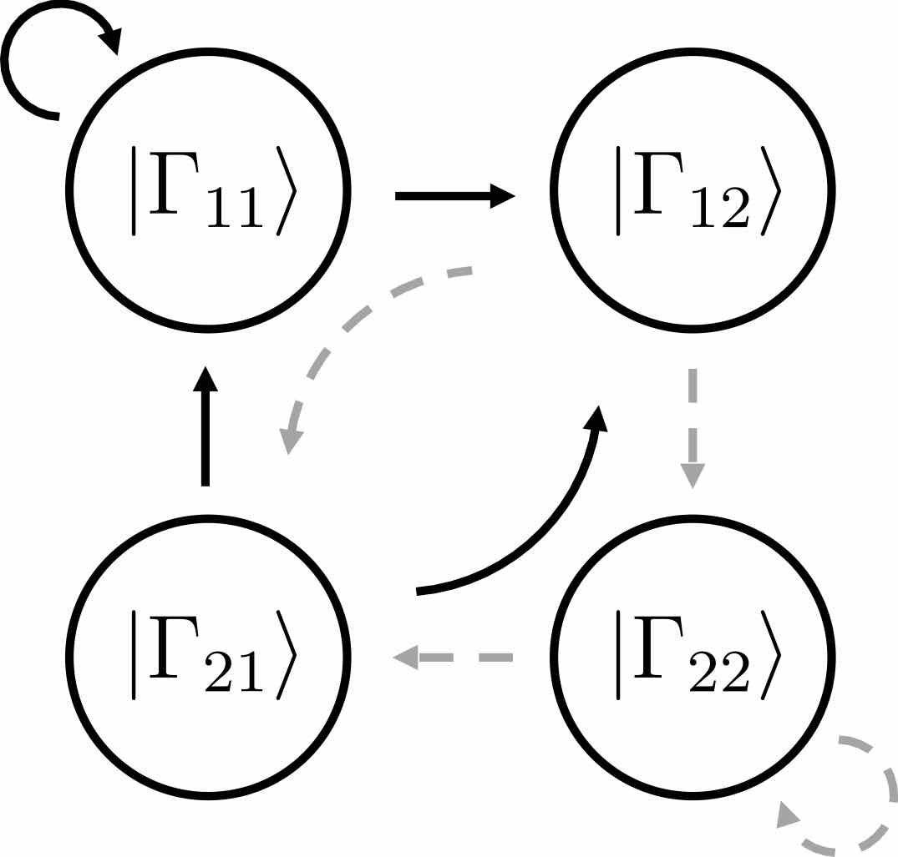
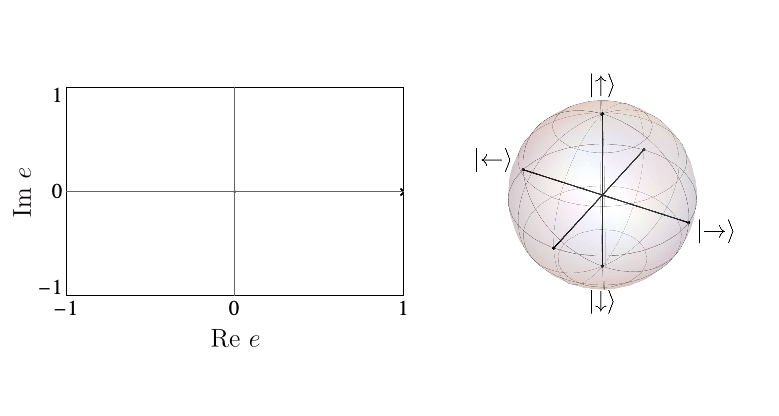
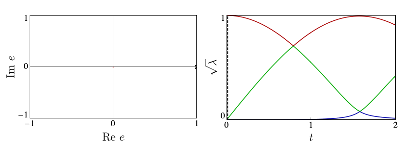

We construct classification of dynamical quantum phase transitions using matrix product states.

<!--more-->

ver since their discovery in 2013, Dynamical Quantum Phase Transitions (DQPTs) have attracted great theoretical and experimental attention as quantum many-phenomena occurring at short time-scales. DQPTs are non-analytic points (sharp changes) occurring in the time-evolution of the fidelity density 𝑓, a quantity that indicates how far a state has evolved away from its initial condition and is zero if the system is exactly in its initial state.

However, the mere observation of a DQPT, usually reliant on numerical calculations, does not shed light on the physical mechanisms that drive it. To address this open question, in our recent work Entanglement view of dynamical quantum phase transitions [Phys. Rev. Lett. 126, 040602 (2021)](https://journals.aps.org/prl/abstract/10.1103/PhysRevLett.126.040602) we used a novel tensor-network based approach. Our work revealed the existence of two distinct physical mechanisms capable of driving DQPTs: if single-spin physics dominates the dynamics, one has precession-driven DQPTs (pDQPTs), whereas when spin-spin interactions dominate one has entanglement-driven DQPTs (eDQPTs).

To uncover these mechanisms, we made use of the efficient encoding of the quantum state afforded by infinite Matrix Product States (iMPS). The iMPS can be seen as a linear superposition of all possible product states generated by an “automaton”, as shown below:

Each circle in the automaton corresponds carries the local state |Γ𝑖𝑗⟩ at a site. The arrows give the allowed choices for the states at the following site, with weights given by square roots of the entanglement spectrum 𝜆𝑖. The number of options available from each site, 2 in the above example, is known as bond dimension 𝜒. In our work, we showed that suitable 𝜒=2 Ansätze are able to capture the mechanisms of p- and eDQPTs. The fidelity density can be obtained by contracting the iMPS with the initial state, yielding the fidelity transfer matrix Tf. DQPTs are then caused by the second-largest eigenvalue of Tf, 𝑒2, overtaking 𝑒1 in magnitude, and this can happen for different reasons.

When the entanglement gap is large, 𝜆1>>𝜆2, the automaton prescribes that the state is approximately given by a product state $|\Gamma_{11}\rangle$, with corrections $|\Gamma_{21,12}\rangle$ at each site being weighted by $\sqrt{\lambda_2/\lambda_1}$. For example, for a system initialized in the all-down state, |𝜓1⟩=|↓⟩ and |𝜓2⟩=|↑⟩. The DQPT is then caused by an abrupt switch in the relative contribution of |↑⟩ and |↓⟩ as they precess respectively away from and towards the initial state. This is the physics of pDQPTs, and can be conveniently visualized on the Bloch sphere:

In contrast, eDQPTs are driven by an avoided crossing in the entanglement spectrum. In this case, near the DQPT the quantum state undergoes a rearrangement whereby the initially off-diagonal component, which for 𝜆2≪𝜆1 provides a correction to the leading top-diagonal component, becomes the dominant contribution. The automaton representation then shows that excitations over the dominant product state can be created at decreasing cost as the gap is reduced. After the avoided crossing the formerly subleading component will become leading; this corresponds to the swap of 𝑒1, 𝑒2 and signals an eDQPT:

In our work, we showed how the mechanism driving a given DQPT is also reflected in the behaviour of a number of physical observables, including the mutual information and one-point functions, opening the door to the experimental probing of the physics behind DQPTs.